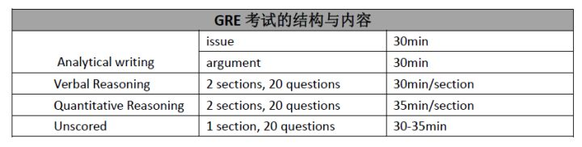
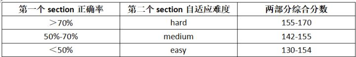

# 霁儿

## GRE是什么？

本节信息来自[GRE考试概述](https://zhuanlan.zhihu.com/p/30611376)。

### **GRE考试的结构与内容简介**

基于计算机的新GRE考试包括下面6个部分：

1. **写作部分**：也就是Analytical Writing（AW），包括一篇 issue 和一篇 argument，每项写作任务各 30 分钟。
2. **语文部分**：也就是Verbal Reasoning（V），一共有2个section, 每个section 30 分钟。每个section分别有10道填空题和10道阅读题，填空与阅读题是乱序出现的。
3. **数学部分**：也就是Quantitative Reasoning（Q）, 一共有2个section, 每个section 35 分钟。
4. **不计分部分**：也就是Unscored, 只有一个section，有可能是语文或者数学的其中一种。

 

考试总时长约为3小时45分钟。

**注意**：不计分部分可能会出现在考试的任何一个section，也就是任何考生都不会知道哪一个section是不计入总分的，因此应该把每一部分都当成是计入总分的部分来做。国内考试中不计分部分通常为语文部分（V），但也有一定概率为数学部分（Q）。

### **GRE考试的评分标准**

GRE作文最终的分数为Argument与Issue这两篇作文得分的平均值。分数区间在0 - 6之间。作文的详细评分标准请读者参考The Official Guide to the GRE revised General Test 2th Edition，这里将不再赘述。

Verbal与Quantitative的成绩除了与考生**答对的题目的数量**有关外，还和考生遇到的题目的**难度系数有关**。

而且，GRE是一门基于section的自适应考试，也就是考生第二个section的题目难度会由第一个section的正确率而定。

一般而言，所有的考生的第一个section的题目都是相同的而且为中等难度（medium）。第2个section有3种情况：easy, medium, hard。考生第2个section遇到哪一种情况则取决于第一个section的答题情况。下面用表格来详细阐述：

 更多详细信息在此不再赘述，可以参考[GRE考试概述](https://zhuanlan.zhihu.com/p/30611376)。

