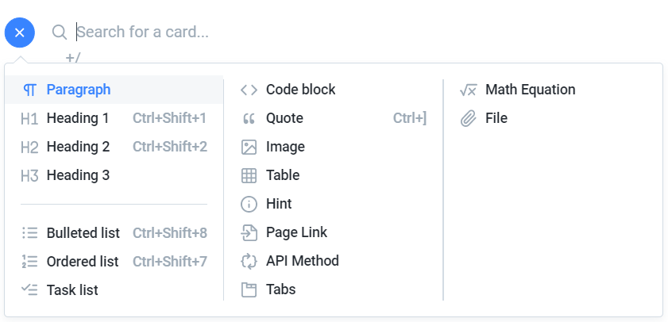

# 合作方法

**注：这部分内容是霁儿快速入门gitbook摸索出来的。很可能不全面 or 有很多错误，欢迎补充**

主要的合作方法有两种：在gitbook.com上在线编辑，和在github.com上合作。对于有git基础的contributor建议用github.com。

## 在gitbook.com在线编辑

1. 登陆gitbook.com。如果没有账号，需要新注册账号。
2. 加入USTC Survival Manual contributor group。自行联系相关人员加入
3. 进入书籍编辑页面 [https://app.gitbook.com/@ustc-sist-survival-manual/s/ustc/](https://app.gitbook.com/@ustc-sist-survival-manual/s/ustc/)，点击每个page即可开始编辑
4. 新建内容：gitbook仅支持二级目录，新建文件夹点击New - New Group，新建文件点击New - New Page即可。
5. 具体编辑：编辑大体使用markdown语法，也可以用图形界面配置文本格式。编辑左侧界面能够展开编辑文本格式，如下图：  
6. 鼠标悬浮于光标处，或选择一段文本，可以看到其他文本格式配置方法。懒得放图

（小声说，gitbook.com比较容易卡，个人觉得编辑器不太人性化，而且不方便定制特性。

## 

